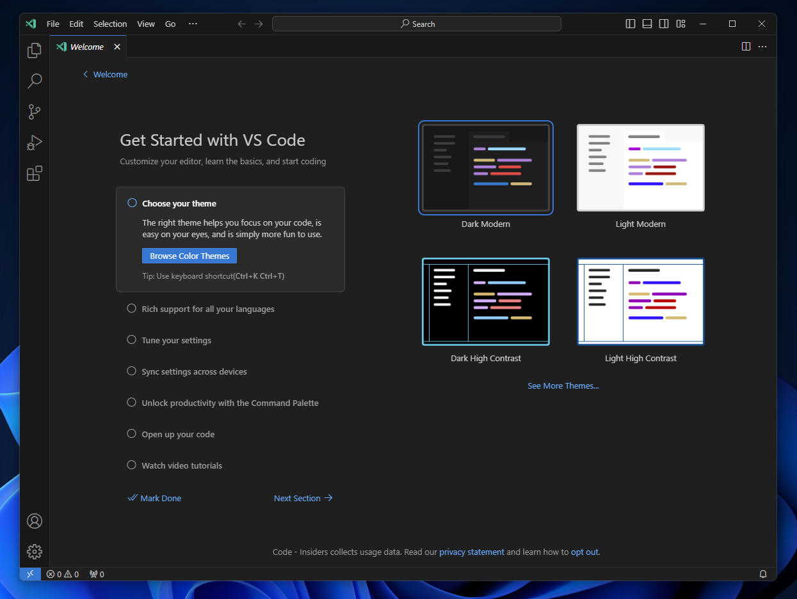
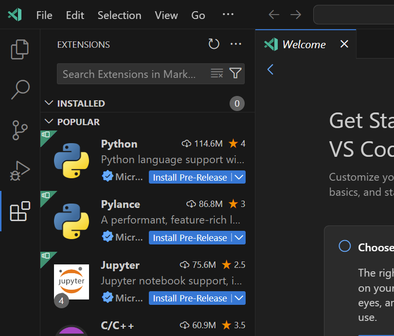

# 環境構築
最初にこれからのサイトを作るうえで必要なアプリケーションをインストールしましょう。
今回、開発に用いるアプリケーションは1つだけです。

## vscode
インストールするアプリはvscodeです。下記のリンクから自分の環境に合う物を選んでダウンロードしましょう。（自分のお気に入りのエディタがあるよという人はそれを使っても構いません。しかしこれからの講座はすべてvscode前提でプラグインなども使っていきます。）

- [vscode](https://code.visualstudio.com/download)（正式名称 Visual Studio Code）  

これがvscodeです。（まっさらなvscodeを使うために画像ではinsiderバージョンを使っています。アイコンの色とかが違うと思いますが気にしなくていいです。）

### プラグインのインストール
先にこの講座で使うvscodeのプラグインをインストールします。
左側のところから四角が四つあるところを押すとプログインを検索できます。

- [live server](https://marketplace.visualstudio.com/items?itemName=ritwickdey.LiveServer)  
  これは作成したhtmlファイルを参照して自動でローカルサーバーを立ち上げブラウザから見れるようにしてくれます。[検索したときの画像](./img/vscode-extension-liveserver.png)

これで必要な環境構築は終了です。