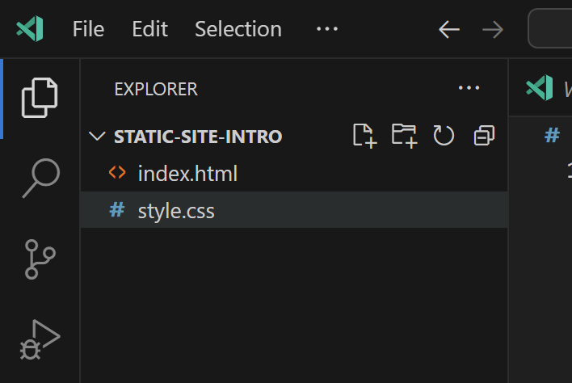

# cssファイルの作成
cssはウェブサイトの外観やスタイルを変更するためのスタイルシートです。
html要素の定義でしたがcssはそれを装飾します。

## step 1
htmlの時と同じようにcssファイルを作成します。
ファイル名は`style.css`です。



## step 2
では実際にcssを書いていきます。
最初は以下のコードを`style.css`にコピペしてください。
後ほど書き足します。

```css
* {
    margin: 0;
    padding: 0;
}

body {
    background: linear-gradient(#e66465, #9198e5);
    width: 100%;
    height: 100dvh;
    display: flex;
    justify-content: center;
    align-items: center;  
}

.main { 
}

```