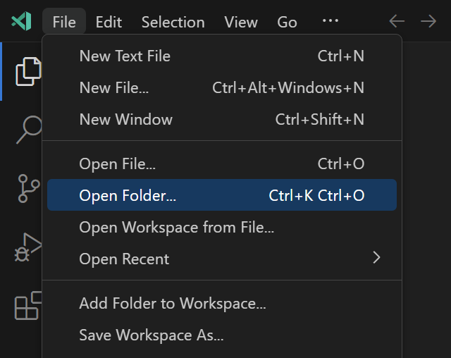
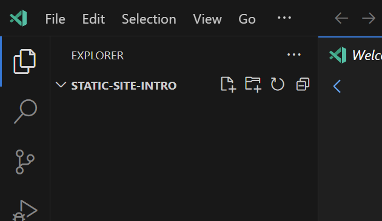

# ファイルを作る
まず最初に作業を行うフォルダをvscodeで開く必要があります。
左上のFileからOpen Folderを選択します。

そして自分の開きたいフォルダーを選択します。[画像](./img/vscode-select-folder.png)  
フォルダーを開くと左上に開いたフォルダの名前が表示されていると思います。

そのフォルダーの名前の右側ににファイルとフォルダーなどのアイコンがあります。
これらをクリックすることでファイルやフォルダーの作成が行えます。