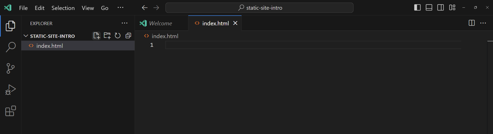
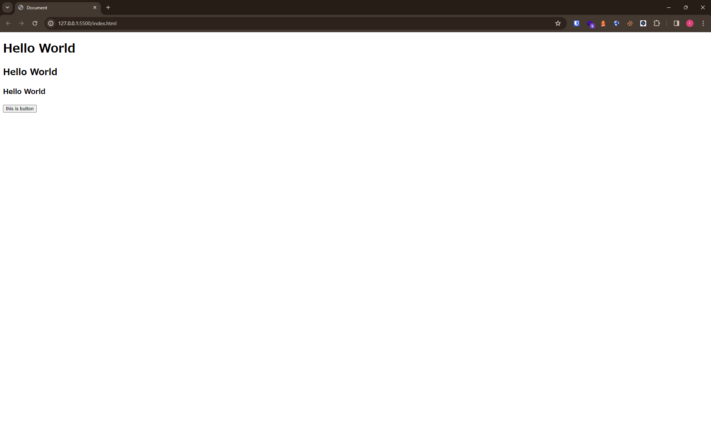

# htmlファイルの作成
htmlはウェブページを作成するためのマークアップ言語です。(厳密にはプログラミング言語ではない。)
htmlはタグで要素を定義します。
どのタグを使うかでウェブサイトにどの要素が表示されるのかが変わります。

```html
<>  開始タグ
</> 終了タグ

<p>段落</p>

<h1>見出し</h1>


```

ウェブサイトの実際に見える部分というのは`<body></body>`タグの中に書かれます。

## step 1
htmlファイルを作成します。



## step2
では実際にhtmlファイルを書いていきましょう。
htmlファイル上で`!`を入力します。[画像](./img/vscode-!.png)  
画像の状態で`Enter`を押すとvscodeがひな形を書いてくれます。[画像](./img/vscode-!-after.png)

<details>
<summary>ひな形で作成されるコード</summary>

```html
<!DOCTYPE html>
<html lang="en">
<head>
    <meta charset="UTF-8">
    <meta name="viewport" content="width=device-width, initial-scale=1.0">
    <title>Document</title>
</head>
<body>
    
</body>
</html>
```
</details>

<br>

では`body`タグの中に書いていきましょう。
以下のコードを`body`タグのなかにコピペしましょう。

```html
    <h1>Hello World</h1>
    <h2>Hello World</h2>
    <h3>Hello World</h3>
    <button>this is button</button>
```

`Ctrl + s`でファイルを保存します。
そうするとファイル名が表示されているところの白い点が消えます。[画像](./img/vscode-file-white-point.png)

## step 3
結果をブラウザで確認しましょう。
ここで追加したプラグインを使用します。
vscodeの左下にある`Go Live`をクリックします。


するとブラウザが立ち上がりウェブサイトが表示されます。🎉

